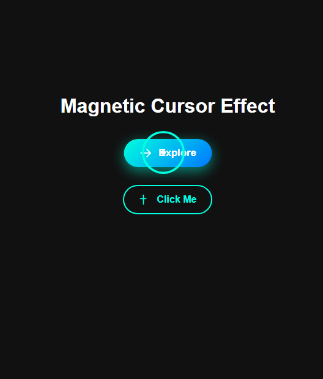

# 🧲 Custom Animated Cursor with Stylish Buttons

This is a simple and beautiful web project demonstrating a **magnetic animated cursor effect**, modern **gradient & ghost buttons**, and full **responsive layout**. Built using pure HTML, CSS, and JavaScript — no frameworks required!

---

## ✨ Features

- 🔁 Smooth magnetic cursor animation
- 🎨 Gradient & ghost button styles
- 🧲 Cursor follows hoverable elements with delay
- 📱 Fully responsive design
- 💡 Uses SVG icons inside buttons
- 🌓 Dark background theme for focus effect

---

## 📸 Demo Preview



[🔗 Live Preview](https://your-live-demo-link.com) <!-- Replace this with your actual live link -->

---

## 🛠️ Tech Used

- HTML5
- CSS3 (Flexbox, Transitions, Gradients)
- JavaScript (DOM Manipulation)
- SVG icons

---

## 📂 Folder Structure

project-folder/
│
├── index.html
└── README.md


---

## 🚀 How to Run Locally

1. Clone the repository:
```bash
git clone https://github.com/yourusername/animated-cursor-buttons.git
Navigate to the project directory:

bash
cd animated-cursor-buttons
Open index.html in your browser.

📱 Responsive Design
This project is fully mobile responsive:

Centered content on all devices

Cursor animation is gracefully disabled on touch devices

🧪 Customization Tips
Want to change the cursor color? Edit .cursor and .cursor-follow classes in style.css.

Add more buttons or SVG icons as needed inside the .btn-group.

Adjust cursor delay by editing lerpFactor in script.js.

📄 License
This project is open-source under the MIT License.

🙌 Author
Made with ❤️ by Lifeonthecode